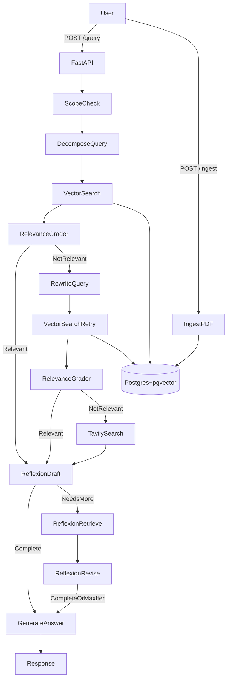

# PageRAG

FastAPI сервис для RAG по финансовой отчетности (10-K/10-Q/8-K) с векторным поиском в Postgres (pgvector), Ollama для LLM/эмбеддингов и агентной оркестрацией через LangGraph (corrective + reflexion).

## Возможности
- Загрузка PDF и нарезка на страницы/чанки с сохранением в Postgres
- Векторный поиск + MMR + BM25 переранжирование
- Corrective RAG: проверка релевантности, переписывание запроса, один ретрай
- Web‑fallback через Tavily API (если локальные документы нерелевантны)
- Reflexion RAG: self‑critique, генерация follow‑up запросов и до 2 итераций уточнения
- Markdown‑ответы на русском

## Архитектура


## Быстрый старт
1) Подготовьте `.env` на основе `.example.env`
2) Запустите сервисы:
```
docker compose up --build
```
3) Проверьте здоровье:
```
curl http://localhost:8000/health
```

## Конфигурация
- Все переменные задаются в `.env`
- Основные:
  - `DATABASE_URL` — подключение к Postgres
  - `OLLAMA_BASE_URL`, `OLLAMA_LLM_MODEL`, `OLLAMA_EMBED_MODEL`
  - `WEB_SEARCH_ENDPOINT`, `WEB_SEARCH_API_KEY` (Tavily)

## API
- `POST /ingest` — загрузка PDF (multipart/form-data, поле `files`)
- `POST /query` — запрос к RAG:
```
{
  "query": "Какая была выручка у Google в 2025 году?",
  "k": 5
}
```
- `GET /health` — healthcheck

## Логи
Логи пайплайна пишутся в `debug_logs/pipeline.log`.
